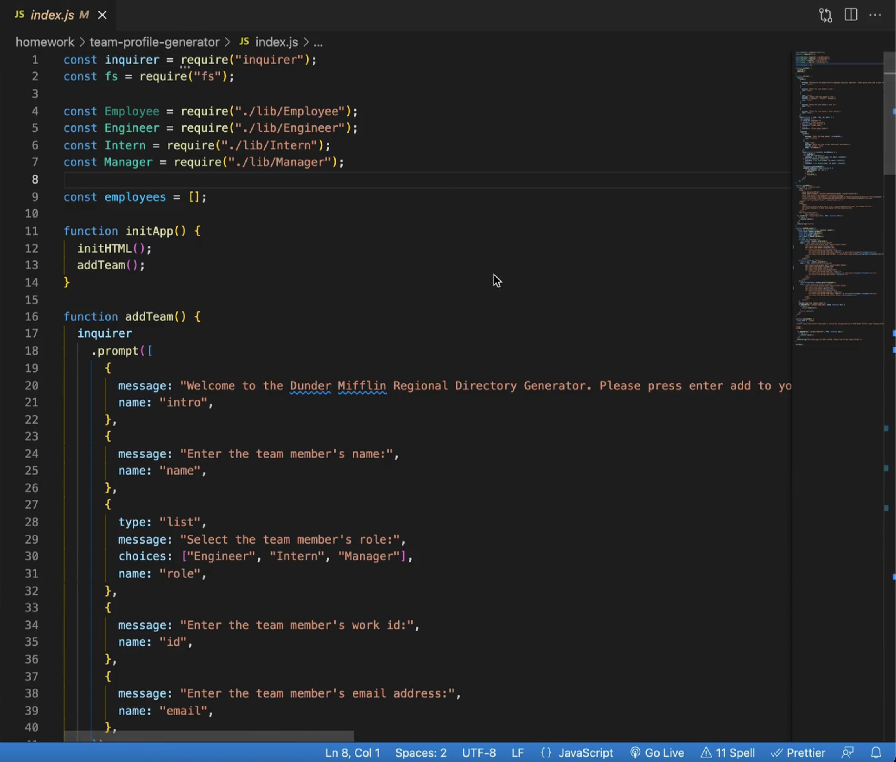

# Team Profile Generator: Dunder Mifflin Office Directory

## Description

This project is a Node.js command-line application that takes in information about employees on a team and generates an HTML webpage that displays summaries for each person. A user can enter any number of team members, assigning them roles such as 'Manager', 'Engineer', or 'Intern' and depending on which role is selected, different information is generated. The final HTML output is styled so that Dunder Mifflin Regional Managers can easily created their office directories. 

## Table of Contents

- [Installation](#installation)
- [Usage](#usage)
- [Credits](#credits)
- [License](#license)
- [Tests](#tests)
- [Questions](#questions)

## Installation

Fork the repo or copy the code and install on your machine. Run the file in your local terminal with command `node index.js`.

## Usage

A video walkthrough of the final project is below:

[Video Walkthrough](https://drive.google.com/file/d/1i6P2E4QxcdzFKesdGJhVd8SK3yhotk8X/view?usp=sharing)

## Credits

Coding was completed by Lauren Ferrett, using references from class activities. NPMs used were Inquirer and FS.

## License

MIT License

Copyright (c) 2022 Lauren Ferrett

Permission is hereby granted, free of charge, to any person obtaining a copy
of this software and associated documentation files (the "Software"), to deal
in the Software without restriction, including without limitation the rights
to use, copy, modify, merge, publish, distribute, sublicense, and/or sell
copies of the Software, and to permit persons to whom the Software is
furnished to do so, subject to the following conditions:

The above copyright notice and this permission notice shall be included in all
copies or substantial portions of the Software.

THE SOFTWARE IS PROVIDED "AS IS", WITHOUT WARRANTY OF ANY KIND, EXPRESS OR
IMPLIED, INCLUDING BUT NOT LIMITED TO THE WARRANTIES OF MERCHANTABILITY,
FITNESS FOR A PARTICULAR PURPOSE AND NONINFRINGEMENT. IN NO EVENT SHALL THE
AUTHORS OR COPYRIGHT HOLDERS BE LIABLE FOR ANY CLAIM, DAMAGES OR OTHER
LIABILITY, WHETHER IN AN ACTION OF CONTRACT, TORT OR OTHERWISE, ARISING FROM,
OUT OF OR IN CONNECTION WITH THE SOFTWARE OR THE USE OR OTHER DEALINGS IN THE
SOFTWARE.

## Tests
Four tests suites are coded into the project, containing a total of 23 tests. Tests are run through the Jest npm and can be run by executing `npm test` in the terminal. 

## Questions
Any questions can be directed to lferrett@gmail.com
